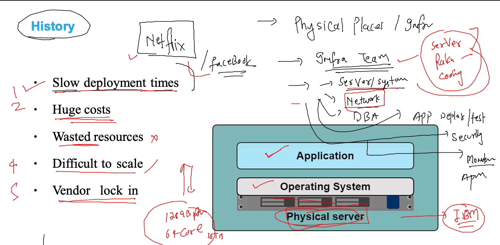
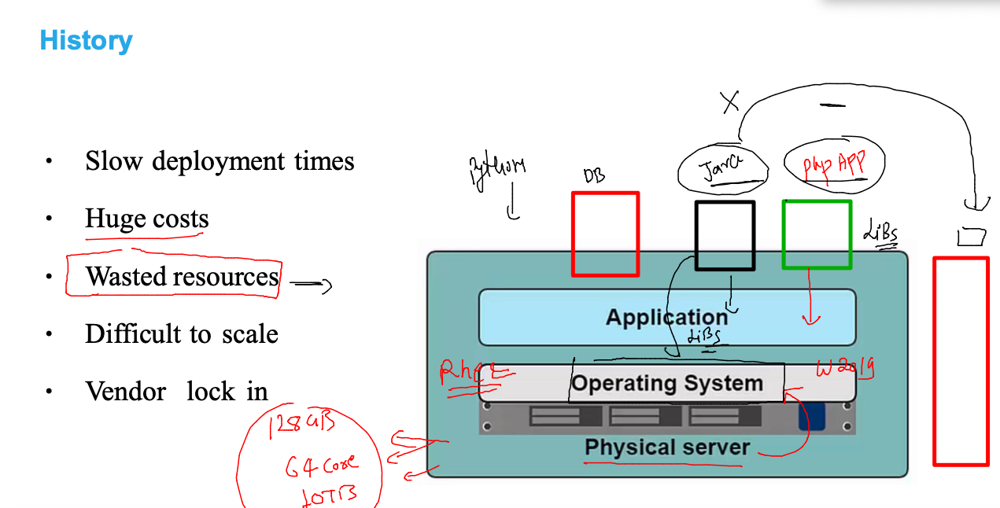
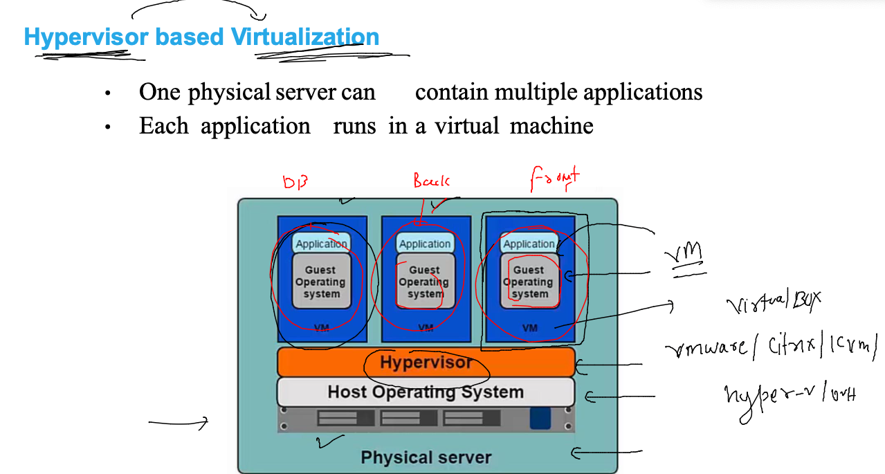
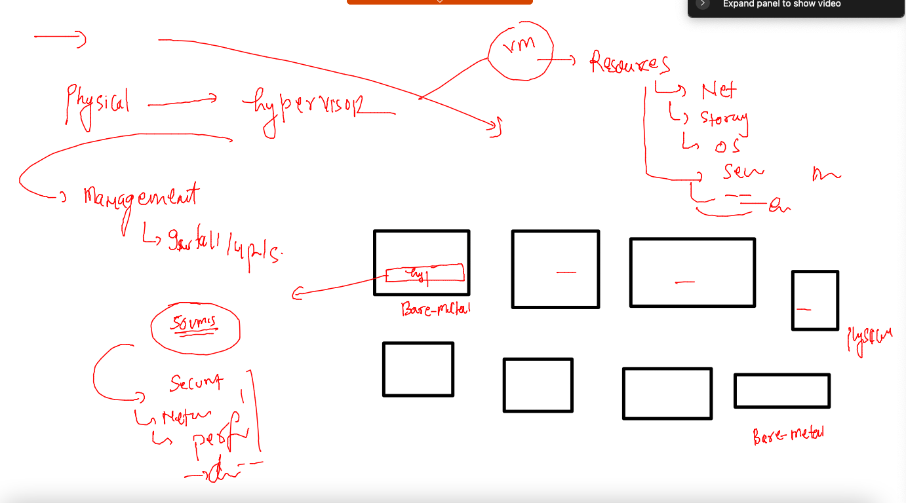
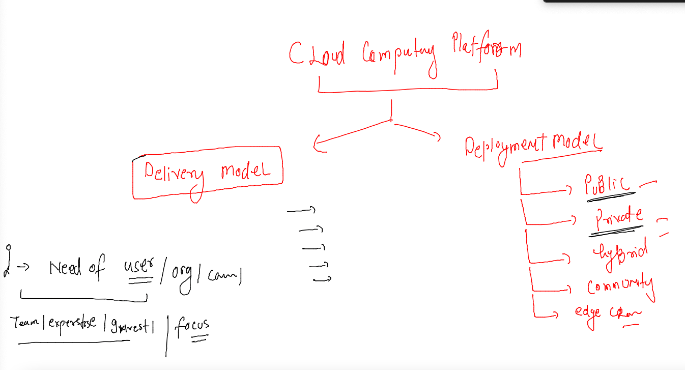
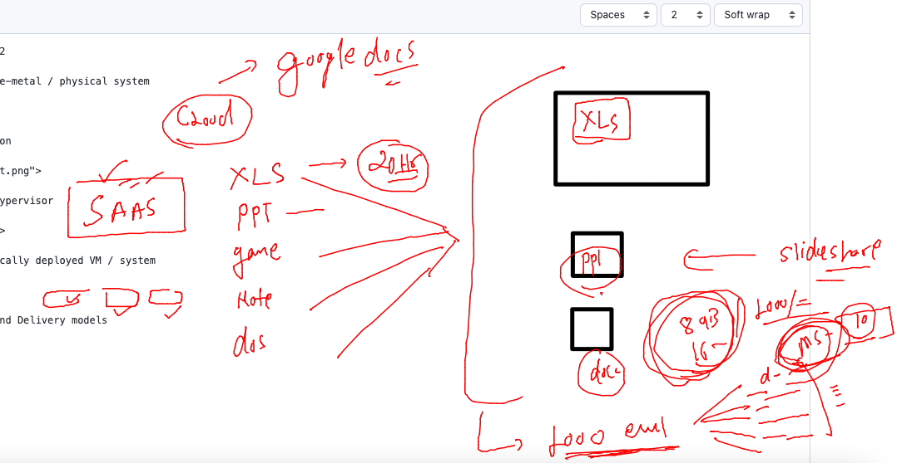
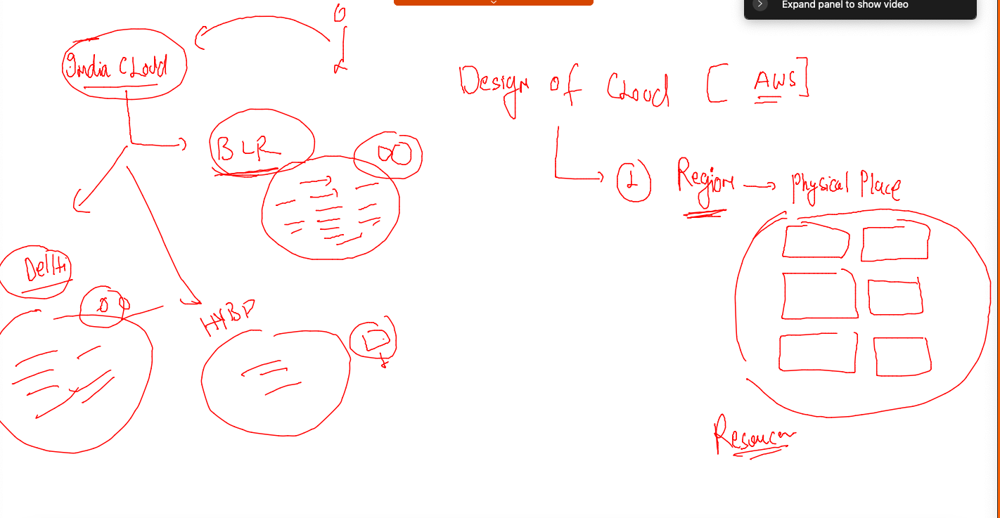
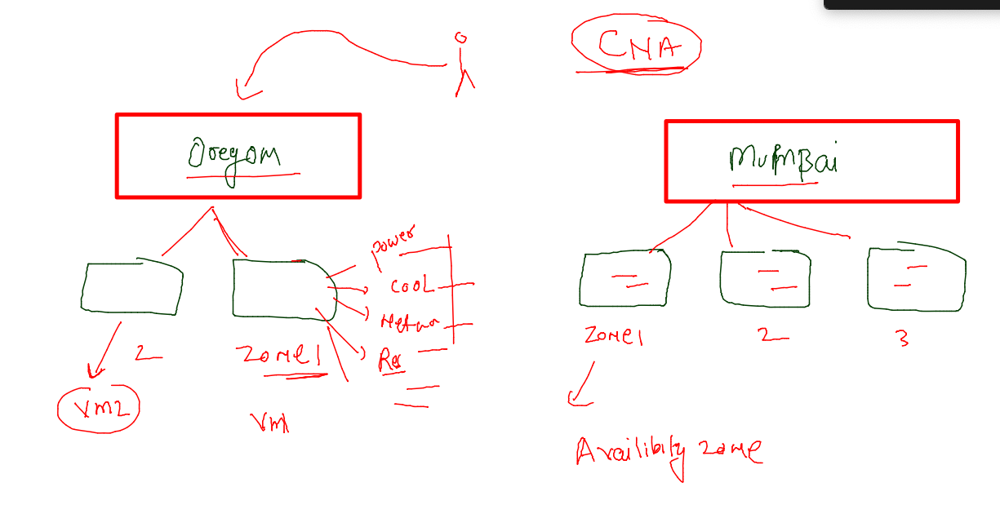
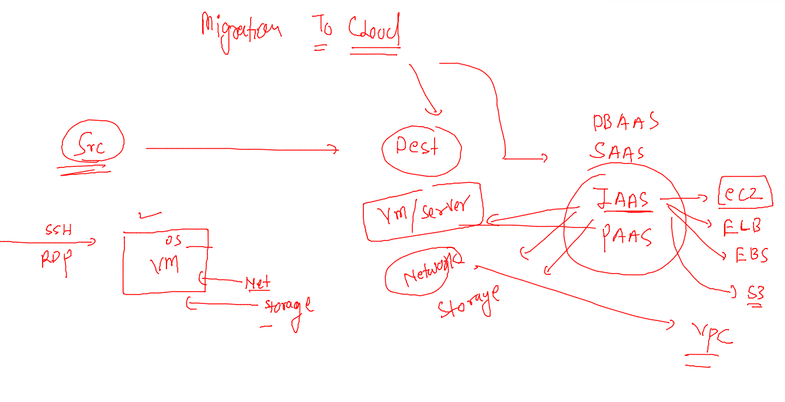
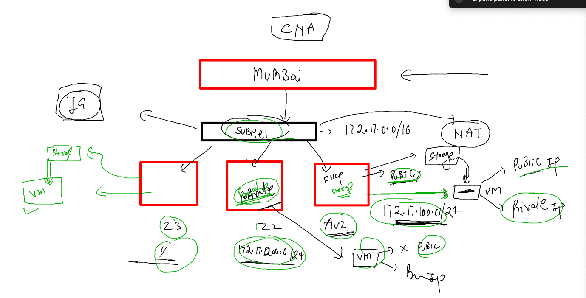

# ciscoCNA-10thoct2022

### Problems with bare-metal / physical system 

### app conflict reason 

### Introduction to Hypervisor 

### problems of physically deployed VM / system 

## Cloud Deployment and Delivery models 

### DBaas 

### SAAS 

## Design model of cloud 

### Region 

### Understanding av zone 

### IAAS Service 

### Avzone -- storage and VM 

