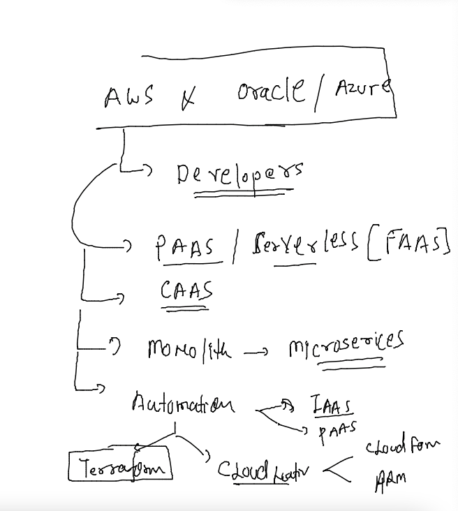
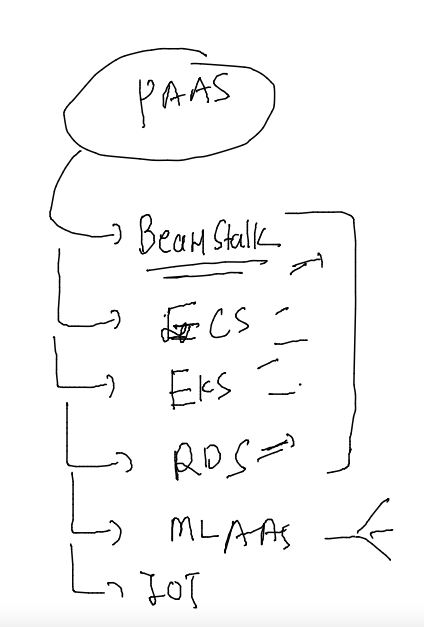
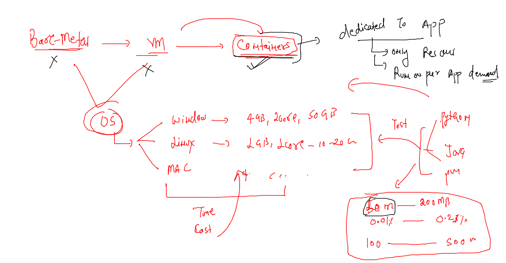
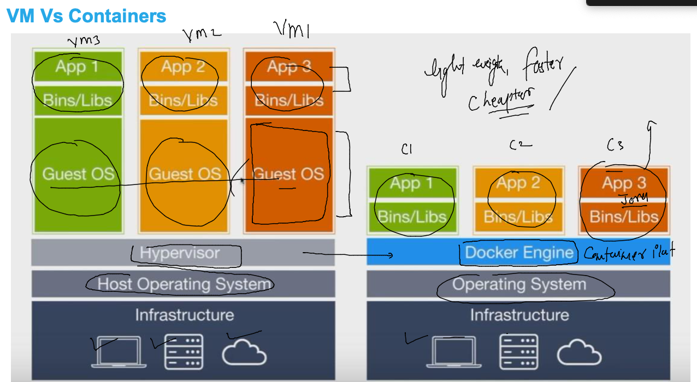
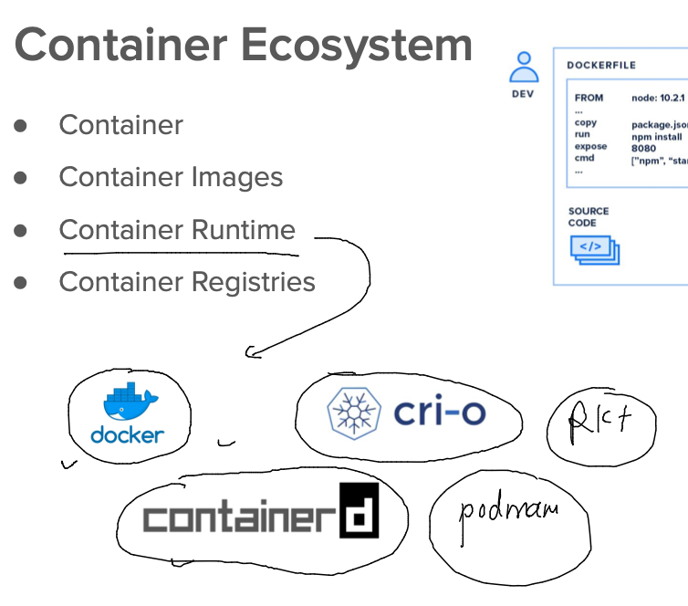

## CLOUD -- Developer can use ..?

### Day 2 agenda 



### PAAS. 


### AWS PAAS 



### container services 



## vm vs containers 



### container runtimes 



### Connecting to docker daemon 

```
[ashu@ip-172-31-44-55 ~]$ docker  version 
Client:
 Version:           20.10.17
 API version:       1.41
 Go version:        go1.18.3
 Git commit:        100c701
 Built:             Thu Jun 16 20:08:47 2022
 OS/Arch:           linux/amd64
 Context:           default
 Experimental:      true
Got permission denied while trying to connect to the Docker daemon socket at unix:///var/run/docker.sock: Get "http://%2Fvar%2Frun%2Fdocker.sock/v1.24/version": dial unix /var/run/docker.sock: connect: permission denied
[ashu@ip-172-31-44-55 ~]$ 

```

### deploy sample app in container 

```
  3  git clone https://github.com/yenchiah/project-website-template.git
    4  ls
    5  mv project-website-template/  ashuapp
    6  ls
    7  pwd
    8  docker run -itd --name ashuc1  -p 1234:80 -v /home/ashu/ashuapp:/usr/share/nginx/html/ nginx 
    9  docker  ps
   10  docker stats
   11  history 
   12  docker ps
   13  docker stats

```


