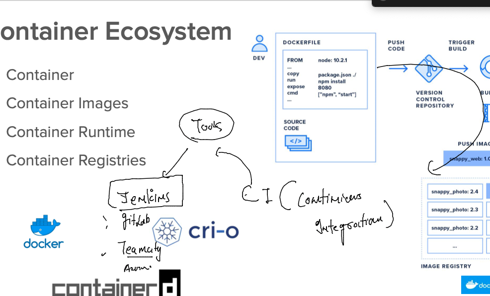
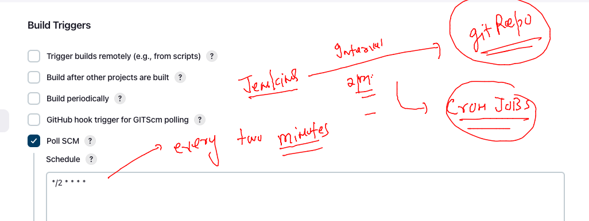
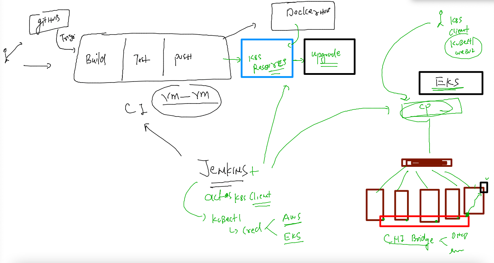

## Creating sample app as container 

### taking code 

```
git clone https://github.com/schoolofdevops/html-sample-app
```
### adding dockerfile 

```
FROM nginx
LABEL name=ashutoshh
COPY html-sample-app /usr/share/nginx/html/
```

### Docker-compose file 

```
version: '3.8'
services:
  ashuapp1:
    image: ashucisco:webappv1  # image i want to build 
    build:  # location & name of dockerfile 
      context: . 
      dockerfile: day4.dockerfile
    container_name: ashuwebc1 # after image build the container i want to create
    ports: # port forwarding 
    - 1234:80 

```

### lets build image and create container -- 

```
[ashu@ip-172-31-44-55 ashu-container-apps]$ docker-compose up -d
[+] Running 0/1
 ⠿ ashuapp1 Warning                                                                         3.0s
[+] Building 2.1s (8/8) FINISHED                                                                 
 => [internal] load build definition from day4app.dockerfile                                0.0s
 => => transferring dockerfile: 120B                                                        0.0s
 => [internal] load .dockerignore                                                           0.0s
 => => transferring context: 2B                                                             0.0s
 => [internal] load metadata for docker.io/library/nginx:latest                             1.8s
 => [auth] library/nginx:pull token for registry-1.docker.io                                0.0s
 => [internal] load build context                                                           0.1s
 => => transferring context: 3.55MB                                                         0.0s
 => CACHED [1/2] FROM docker.io/library/nginx@sha256:2f770d2fe27bc85f68fd7fe6a63900ef7076b  0.0s
 => [2/2] COPY html-sample-app /usr/share/nginx/html/                                       0.1s
 => exporting to image                                                                      0.1s
 => => exporting layers                                                                     0.0s
 => => writing image sha256:c8ae9279394921869ea3a09442c0584270854fa2db91c0bd541ba5003d1bd4  0.0s
 => => naming to docker.io/library/ashucisco:webappv1                                       0.0s
[+] Running 2/2
 ⠿ Network ashu-container-apps_default  Created                                             0.0s
 ⠿ Container ashuwebc1                  Started                                             0.7s
[ashu@ip-172-31-44-55 ashu-container-apps]$ 
```

### checking 

```
[ashu@ip-172-31-44-55 ashu-container-apps]$ docker-compose  images
Container           Repository          Tag                 Image Id            Size
ashuwebc1           ashucisco           webappv1            c8ae92793949        145MB
[ashu@ip-172-31-44-55 ashu-container-apps]$ docker-compose  ps
NAME                COMMAND                  SERVICE             STATUS              PORTS
ashuwebc1           "/docker-entrypoint.…"   ashuapp1            running             0.0.0.0:1234->80/tcp, :::1234->80/tcp
[ashu@ip-172-31-44-55 ashu-container-apps]$ 
```

### compsoe commands 

```
 299  docker-compose  -f  docker-compose1.yaml  ps 
  300  docker-compose  -f  docker-compose1.yaml  down 
  301  docker-compose  -f  docker-compose1.yaml  up -d
  302  docker-compose  -f  docker-compose1.yaml  ps
  303  docker-compose  -f  docker-compose1.yaml  stop 
  304  history 
[ashu@ip-172-31-44-55 ashu-container-apps]$ docker-compose ps 
NAME                COMMAND                  SERVICE             STATUS              PORTS
ashuwebc1           "/docker-entrypoint.…"   ashuapp1            exited (0)          
[ashu@ip-172-31-44-55 ashu-container-apps]$ docker-compose start
[+] Running 1/1
 ⠿ Container ashuwebc1  Started                                                             0.5s
[ashu@ip-172-31-44-55 ashu-container-
```

### lets automate entire container images builds and test process using CI tool jenkins



## TIme for CI process using jenkins 

### ALL developers need to have their code on ANY SCM like github 

### creating and cloning git rpeo 

```
[ashu@ip-172-31-44-55 ashu-container-apps]$ git clone https://github.com/redashu/ashu-cisco-app.git
Cloning into 'ashu-cisco-app'...
remote: Enumerating objects: 3, done.
remote: Counting objects: 100% (3/3), done.
remote: Total 3 (delta 0), reused 0 (delta 0), pack-reused 0
Receiving objects: 100% (3/3), done.
[ashu@ip-172-31-44-55 ashu-container-apps]$ ls
app_deploy.yaml  day4app.dockerfile   Dockerfile       ui-app
ashu-cisco-app   docker-compose.yaml  html-sample-app
[ashu@ip-172-31-44-55 ashu-container-apps]$ 


```

### copied code and docker data to repo 

```
ashu@ip-172-31-44-55 ashu-container-apps]$ ls
app_deploy.yaml  day4app.dockerfile   Dockerfile       ui-app
ashu-cisco-app   docker-compose.yaml  html-sample-app
[ashu@ip-172-31-44-55 ashu-container-apps]$ ls
app_deploy.yaml  day4app.dockerfile   Dockerfile       ui-app
ashu-cisco-app   docker-compose.yaml  html-sample-app
[ashu@ip-172-31-44-55 ashu-container-apps]$ cp -rfv day4app.dockerfile   ashu-cisco-app/
‘day4app.dockerfile’ -> ‘ashu-cisco-app/day4app.dockerfile’
[ashu@ip-172-31-44-55 ashu-container-apps]$ cp -rfv docker-compose.yaml   ashu-cisco-app/
‘docker-compose.yaml’ -> ‘ashu-cisco-app/docker-compose.yaml’
[ashu@ip-172-31-44-55 ashu-container-apps]$ cp -rf html-sample-app/   ashu-cisco-app/
[ashu@ip-172-31-44-55 ashu-container-apps]$ 

```

###  pushing code on github repo 

```
331  git add . 
 
  335  git config --global user.name redashu
  338  git config --global user.email ashutoshh@linux.com
  339  git commit  -m  "app changes v1 "
 ashu@ip-172-31-44-55 ashu-cisco-app]$ git push 
Enumerating objects: 5, done.
Counting objects: 100% (5/5), done.
Delta compression using up to 2 threads
Compressing objects: 100% (4/4), done.
Writing objects: 100% (4/4), 654 bytes | 654.00 KiB/s, done.
Total 4 (delta 0), reused 0 (delta 0), pack-reused 0
To https://github.com/redashu/ashu-cisco-app.git
   7feb632..ef25d4c  master -> maste
```


### creating jenkins jobs to check in every two minutes about -- repo changes 



### in jenkins build step 

```
docker-compose down 
docker-compose up -d --build 
sleep 3
docker-compose ps 
```

### Lets begin CD by jenkins -- which is going to be k8s client 




