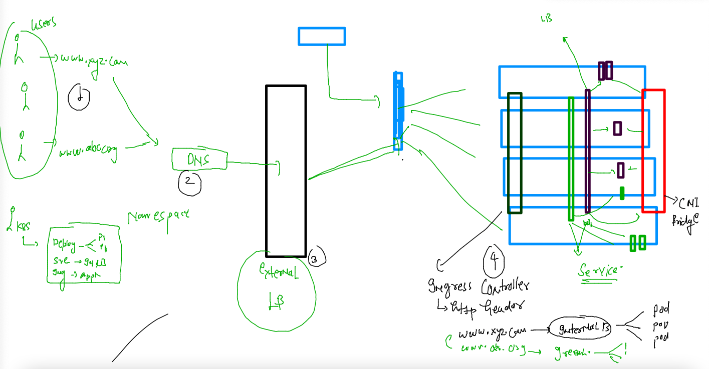

# CNA final Day 

### CI-CD and k8s Revision 

### k8s Cloud native architecutre for microservice based container app deployment and networking 



## to deploy application manually -- lets start step by step 

### creating & checking namespaces 

```
[ashu@ip-172-31-44-55 ashu-container-apps]$ kubectl  get  ns
NAME                   STATUS   AGE
default                Active   85m
ingress-nginx          Active   58m
kube-node-lease        Active   85m
kube-public            Active   85m
kube-system            Active   85m
kubernetes-dashboard   Active   56m
[ashu@ip-172-31-44-55 ashu-container-apps]$ kubectl  get  namespaces 
NAME                   STATUS   AGE
default                Active   85m
ingress-nginx          Active   58m
kube-node-lease        Active   85m
kube-public            Active   85m
kube-system            Acti
```


### creating 

```
[ashu@ip-172-31-44-55 ashu-container-apps]$ kubectl  create namespace  ashu-space 
namespace/ashu-space created
[ashu@ip-172-31-44-55 ashu-container-apps]$ kubectl  get  namespaces 
NAME                   STATUS   AGE
ashu-space             Active   7s
default                Active   86m
gowtham-space          Active   5s
ingress-nginx          Active   59m
kube-node-lease        Active   86m
kube-public            Active   86m
kube-system            Active   86m
kubernetes-dashboard   Active   57m
[ashu@ip-172-31-44-55 ashu-container-apps]$ kubectl  config set-context --current --namespace=ashu-space 
Context "eks" modified.
[ashu@ip-172-31-44-55 ashu-container-apps]$ kubectl config get-contexts 
CURRENT   NAME   CLUSTER                                                 AUTHINFO                                                NAMESPACE
*         eks    arn:aws:eks:ap-south-1:751136288263:cluster/cisco-eks   arn:aws:eks:ap-south-1:751136288263:cluster/cisco-eks   ashu-space
```


