##  Micro-services and its deployment using COntainers & kubernetes 

### Microservices planning and deployment 

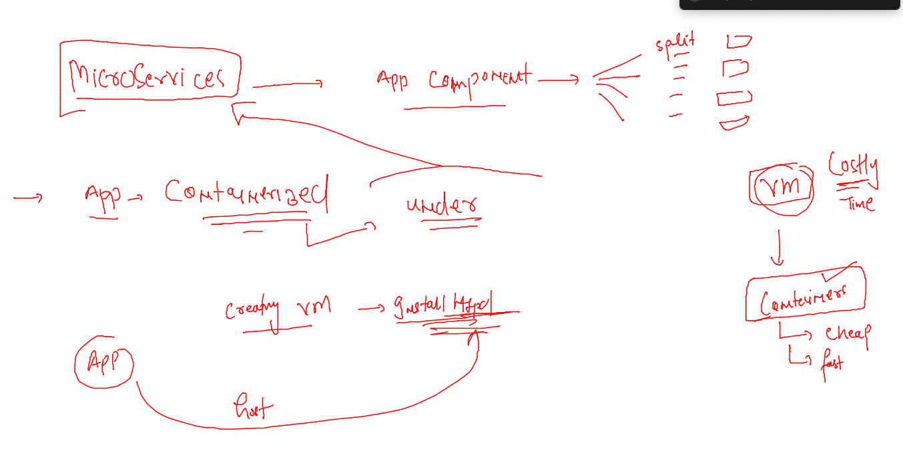

### microservices & Containers 

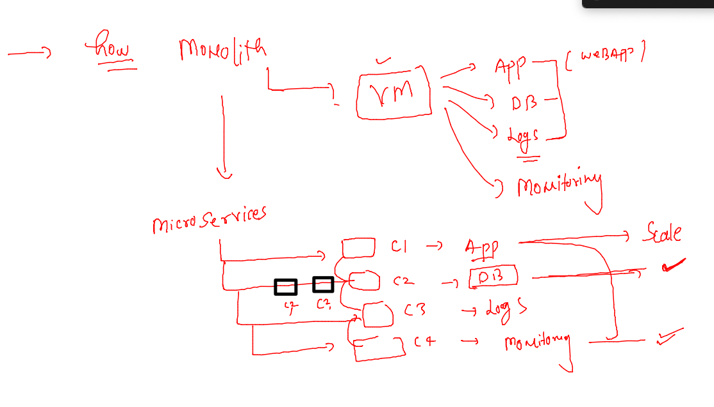

### APPlication containerization 

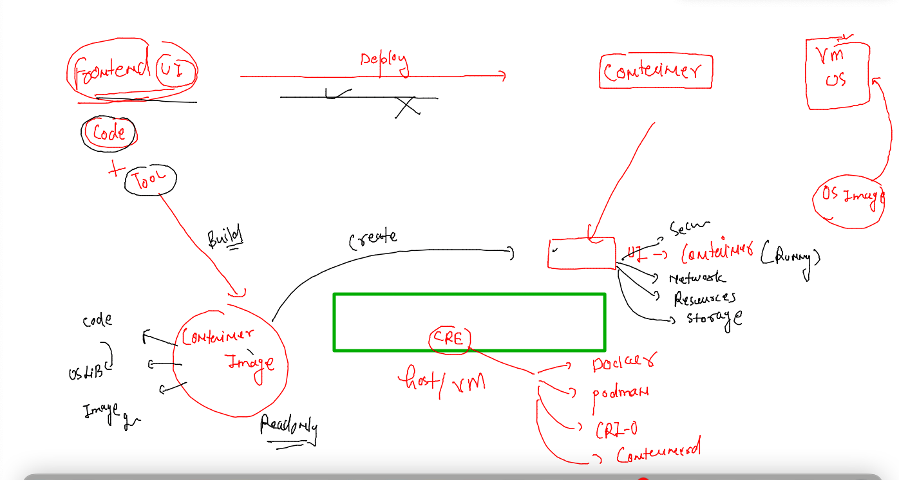

### CNA along with Containerization --  standard -- OCI 

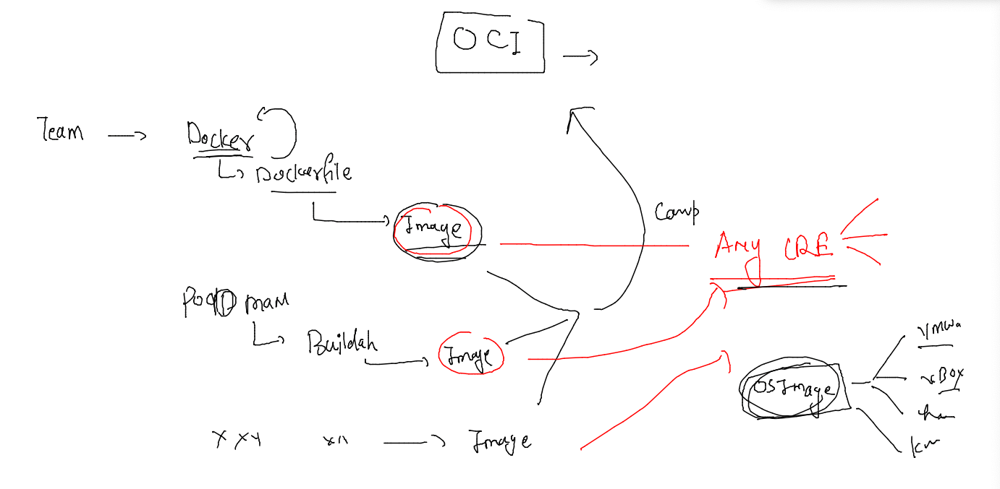

### Link for OCI 

[click_here](https://opencontainers.org/)

## Taking sample UI app -- hosting into container 

### take app code 

```
  28  mkdir  myapps 
   29  ls
   30  pwd
   31  ls
   32  git clone https://github.com/ShaifArfan/one-page-website-html-css-project.git
   33  history 
[ashu@ip-172-31-44-55 myapps]$ ls
one-page-website-html-css-project
[ashu@ip-172-31-44-55 myapps]$ ls
ui-app
```

### add any container image building tool to build image -- 

### Dockerfile 

```
FROM nginx 
# this is pre-defined docker image by docker 
LABEL name=ashutoshh
LABEL email=ashutoshh@linux.com 
# just to share image creator info for help purpose 
COPY ui-app /usr/share/nginx/html/
# copy code to nginx app server 
```

### lets build image 

```
[ashu@ip-172-31-44-55 myapps]$ ls
Dockerfile  ui-app
[ashu@ip-172-31-44-55 myapps]$ docker  build -t  ashuapp:v1  . 
Sending build context to Docker daemon  794.1kB
Step 1/4 : FROM nginx
 ---> 51086ed63d8c
Step 2/4 : LABEL name=ashutoshh
 ---> Running in 348d411b6312
Removing intermediate container 348d411b6312
 ---> b28c6f4f1536
Step 3/4 : LABEL email=ashutoshh@linux.com
 ---> Running in 6e763d8be3cc
Removing intermediate container 6e763d8be3cc
 ---> 4593c46a2053
Step 4/4 : COPY ui-app /usr/share/nginx/html/
 ---> af9e6784238e
Successfully built af9e6784238e
Successfully tagged ashuapp:v1
```

### checking images 

```
[ashu@ip-172-31-44-55 myapps]$ docker  images
REPOSITORY   TAG       IMAGE ID       CREATED          SIZE
ashuapp      v1        af9e6784238e   19 seconds ago   142MB
nginx        latest    51086ed63d8c   6 days ago       142MB
[ashu@ip-172-31-44-55 myapps]$ 
```

### creating container 

```
[ashu@ip-172-31-44-55 myapps]$ docker run -d --name ashuapp1 -p 1234:80  ashuapp:v1 
f45b637b3ded26398eef84f04886be8080b4375a35d108207c9e5ef053e78ec2
[ashu@ip-172-31-44-55 myapps]$ docker  ps
CONTAINER ID   IMAGE        COMMAND                  CREATED         STATUS         PORTS                                   NAMES
f45b637b3ded   ashuapp:v1   "/docker-entrypoint.…"   3 seconds ago   Up 2 seconds   0.0.0.0:1234->80/tcp, :::1234->80/tcp   ashuapp1
[ashu@ip-172-31-44-55 myapps]$ 

```

### Scripting docker steps 

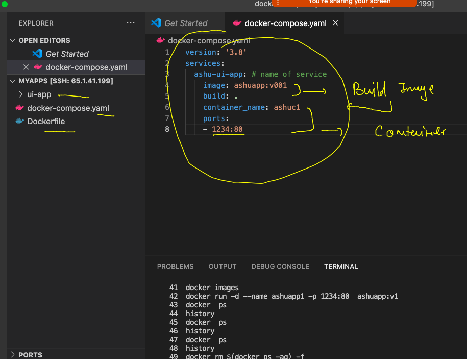

### running compose 

```
[ashu@ip-172-31-44-55 ashu-container-apps]$ docker-compose  up -d
[+] Running 2/2
 ⠿ Network ashu-container-apps_default  Created                                   0.1s
 ⠿ Container ashuc1                     Started                                   0.7s
[ashu@ip-172-31-44-55 ashu-container-apps]$ docker-compose  ps
NAME                COMMAND                  SERVICE             STATUS              PORTS
ashuc1              "/docker-entrypoint.…"   ashu-ui-app         running             0.0.0.0:1234->80/tcp, :::1234->80/tcp
[ashu@ip-172-31-44-55 ashu-container-apps]$ 


```

### to destroy all 

```
[ashu@ip-172-31-44-55 ashu-container-apps]$ docker-compose  up -d
[+] Running 2/2
 ⠿ Network ashu-container-apps_default  Created                                   0.1s
 ⠿ Container ashuc1                     Started                                   0.7s
[ashu@ip-172-31-44-55 ashu-container-apps]$ docker-compose  ps
NAME                COMMAND                  SERVICE             STATUS              PORTS
ashuc1              "/docker-entrypoint.…"   ashu-ui-app         running             0.0.0.0:1234->80/tcp, :::1234->80/tcp
[ashu@ip-172-31-44-55 ashu-container-apps]$ docker-compose  down 
[+] Running 2/2
 ⠿ Container ashuc1                     Removed                                                  0.8s
 ⠿ Network ashu-container-apps_default  Removed                                                  0.1s
[ashu@ip-172-31-44-55 ashu-container-apps]$ 

```
### SOme standards 

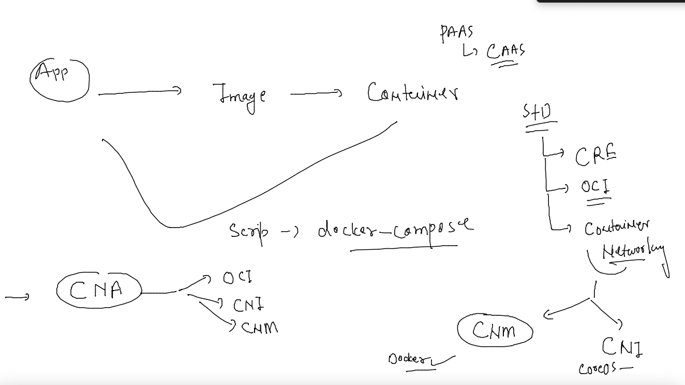

### Deploying containers based application in Distributed environment is having some known issues 

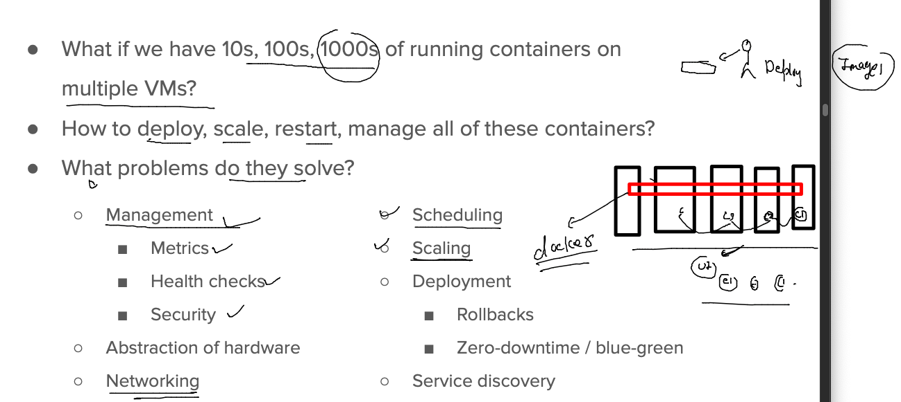

## Introduction to k8s 

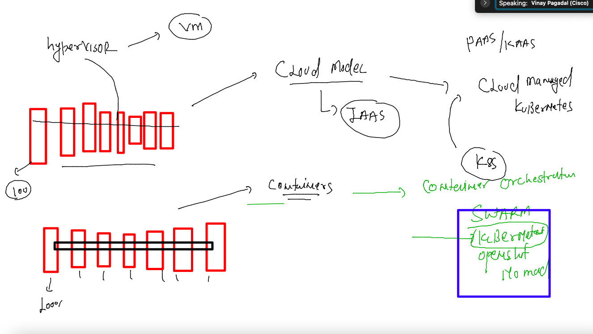

### k8s on cloud 

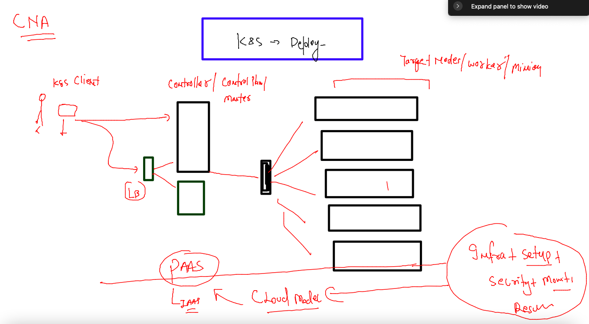

### k8s benefits on cloud 

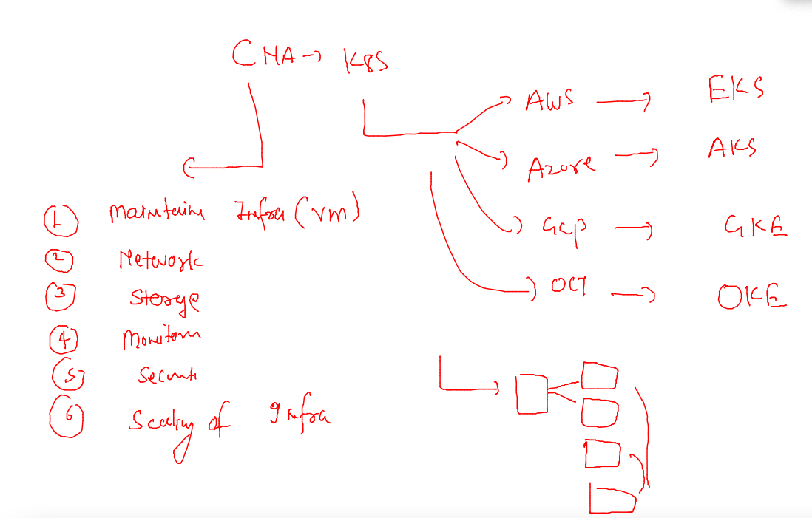

### k8s client 

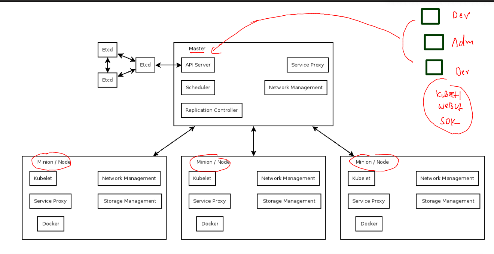

### checking client 

```
[ashu@ip-172-31-44-55 ashu-container-apps]$ 
[ashu@ip-172-31-44-55 ashu-container-apps]$ kubectl  version --client 
Client Version: version.Info{Major:"1", Minor:"23", GitVersion:"v1.23.6", GitCommit:"ad3338546da947756e8a88aa6822e9c11e7eac22", GitTreeState:"clean", BuildDate:"2022-04-14T08:49:13Z", GoVersion:"go1.17.9", Compiler:"gc", Platform:"linux/amd64"}
[ashu@ip-172-31-44-55 ashu-container-apps]$ 

```

### EKS connection  after setting aws congiure 

```
 kubectl   cluster-info  --kubeconfig /tmp/eks-cred  
Kubernetes control plane is running at https://BB48C747C2126F16F8B15FF9A338ED9E.gr7.ap-south-1.eks.amazonaws.com
CoreDNS is running at https://BB48C747C2126F16F8B15FF9A338ED9E.gr7.ap-south-1.eks.amazonaws.com/api/v1/namespaces/kube-system/services/kube-dns:dns/proxy

To further debug and diagnose cluster problems, use 'kubectl cluster-info dump'.
[ashu@ip-172-31-44-55 ashu-container-apps]$ 

```

### kubectl client 

```
[ashu@ip-172-31-44-55 ashu-container-apps]$ kubectl  get nodes   --kubeconfig /tmp/eks-cred  
NAME                                            STATUS   ROLES    AGE   VERSION
ip-192-168-47-179.ap-south-1.compute.internal   Ready    <none>   21m   v1.22.12-eks-ba74326
ip-192-168-82-186.ap-south-1.compute.internal   Ready    <none>   21m   v1.22.12-eks-ba74326
[ashu@ip-172-31-44-55 ashu-container-apps]$ 


```

### Copy k8s client config 

```
[ashu@ip-172-31-44-55 ashu-container-apps]$ mkdir ~/.kube 
mkdir: cannot create directory ‘/home/ashu/.kube’: File exists
[ashu@ip-172-31-44-55 ashu-container-apps]$ cp -v /tmp/eks-cred   ~/.kube/config 
‘/tmp/eks-cred’ -> ‘/home/ashu/.kube/config’
[ashu@ip-172-31-44-55 ashu-container-apps]$ 
[ashu@ip-172-31-44-55 ashu-container-apps]$ kubectl   get  nodes
NAME                                            STATUS   ROLES    AGE   VERSION
ip-192-168-47-179.ap-south-1.compute.internal   Ready    <none>   27m   v1.22.12-eks-ba74326
ip-192-168-82-186.ap-south-1.compute.internal   Ready    <none>   27m   v1.22.12-eks-ba74326
[ashu@ip-172-31-44-55 ashu-container-apps]$ 


```

## application deploy to k8s Journey 

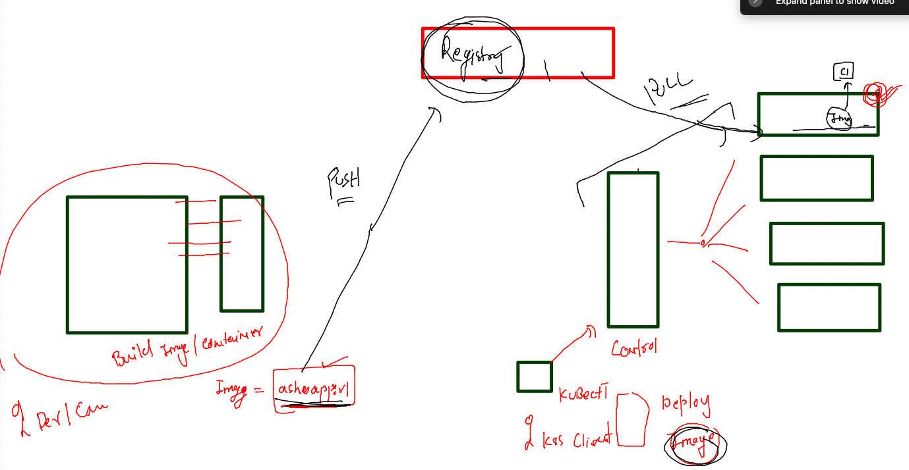

### image pushing to docker hub to deploy in k8s 

```
ashuapp           v001      d4a97b46148e   4 hours ago   142MB
[ashu@ip-172-31-44-55 ashu-container-apps]$ 
[ashu@ip-172-31-44-55 ashu-container-apps]$ docker  tag  ashuapp:v001   dockerashu/ashuapp:v001 
[ashu@ip-172-31-44-55 ashu-container-apps]$ docker login -u dockerashu
Password: 
WARNING! Your password will be stored unencrypted in /home/ashu/.docker/config.json.
Configure a credential helper to remove this warning. See
https://docs.docker.com/engine/reference/commandline/login/#credentials-store

Login Succeeded
[ashu@ip-172-31-44-55 ashu-container-apps]$ 


====
[ashu@ip-172-31-44-55 ashu-container-apps]$ docker push  dockerashu/ashuapp:v001
The push refers to repository [docker.io/dockerashu/ashuapp]
9e1696485880: Pushed 
d6a3537fc36a: Mounted from library/nginx 
819eb3a45632: Mounted from library/nginx 
5eda6fa69be4: Mounted from library/nginx 
6f4f3ce1dca0: Mounted from library/nginx 

```

### Creating deployment using YAML 

```
[ashu@ip-172-31-44-55 ashu-container-apps]$ kubectl  create deployment  ashu-webapp --image=dockerashu/ashuapp:v001  --replicas=1  --port 80 --dry-run=client -o yaml  >app_deploy.yaml 
[ashu@ip-172-31-44-55 ashu-container-apps]$ ls
app_deploy.yaml  docker-compose.yaml  Dockerfile  ui-app
[ashu@ip-172-31-44-55 ashu-container-apps]$ 

```

### lets deploy it 

```
[ashu@ip-172-31-44-55 ashu-container-apps]$ kubectl  apply -f  app_deploy.yaml 
deployment.apps/ashu-webapp created
[ashu@ip-172-31-44-55 ashu-container-apps]$ kubectl  get  deployments 
NAME          READY   UP-TO-DATE   AVAILABLE   AGE
ashu-webapp   0/1     1            0           6s
[ashu@ip-172-31-44-55 ashu-container-apps]$ 

```

### check more details about pods 

```
 91  history 
   92  kubectl  create deployment  ashu-webapp --image=dockerashu/ashuapp:v001  --replicas=1  --port 80 --dry-run=client -o 
[ashu@ip-172-31-44-55 ashu-container-apps]$ kubectl  get  nodes
NAME                                           STATUS   ROLES    AGE   VERSION
ip-192-168-24-65.ap-south-1.compute.internal   Ready    <none>   54m   v1.22.12-eks-ba74326
ip-192-168-64-96.ap-south-1.compute.internal   Ready    <none>   52m   v1.22.12-eks-ba74326
[ashu@ip-172-31-44-55 ashu-container-apps]$ 
[ashu@ip-172-31-44-55 ashu-container-apps]$ kubectl  get  pods -o wide
NAME                                READY   STATUS    RESTARTS   AGE     IP               NODE                                           NOMINATED NODE   READINESS GATES
akp-webapp-8f95fcdc5-pcd9h          1/1     Running   0          5m      192.168.15.25    ip-192-168-24-65.ap-south-1.compute.internal   <none>           <none>
ar-nikhil-webapp-6b444d5959-qjpfv   1/1     Running   0          4m40s   192.168.78.16    ip-192-168-64-96.ap-south-1.compute.internal   <none>           <none>
ashu-webapp-6d7f784599-7xv44        1/1     Running   0          6m7s    192.168.90.222   ip-192-168-64-96.ap-south-1.compute.internal   <none>           <none>
gowtham-webapp-59ddd9d47f-9tv44     1/1     Running   0          5m33s   192.168.91.94    ip-192-168-64-96.ap-south-1.compute.internal   <none>           <none>
mrsethi-app-6dfb498fc-2s62v         1/1     Running   0          6m      192.168.86.227   ip-192-168-64-96.ap-south-1.compute.internal   <none>           <none>
ravi-app-5db568d77f-4j45m           1/1     Running   0          5m33s   192.168.13.161   ip-192-168-24-65.ap-south-1.compute.internal   <none>           <none>
rishabh-webapp-56477874b5-g9cc5     1/1     Running   0          5m53s   192.168.73.125   ip-192-168-64-96.ap-south-1.compute.internal   <none>           <none>
srushti-webapp-67c99fdb6d-p5vpp     1/1     Running   0          2m52s   192.168.31.207   ip-192-168-24-65.ap-south-1.compute.internal   <none>           <none>
```


