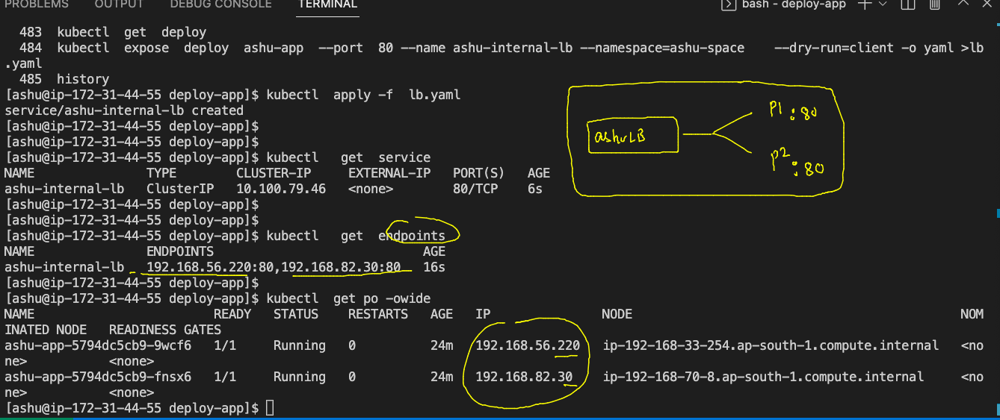

# CNA final Day 

### CI-CD and k8s Revision 

### k8s Cloud native architecutre for microservice based container app deployment and networking 


## to deploy application manually -- lets start step by step 

### creating & checking namespaces 

```
[ashu@ip-172-31-44-55 ashu-container-apps]$ kubectl  get  ns
NAME                   STATUS   AGE
default                Active   85m
ingress-nginx          Active   58m
kube-node-lease        Active   85m
kube-public            Active   85m
kube-system            Active   85m
kubernetes-dashboard   Active   56m
[ashu@ip-172-31-44-55 ashu-container-apps]$ kubectl  get  namespaces 
NAME                   STATUS   AGE
default                Active   85m
ingress-nginx          Active   58m
kube-node-lease        Active   85m
kube-public            Active   85m
kube-system            Acti
```


### creating 

```
[ashu@ip-172-31-44-55 ashu-container-apps]$ kubectl  create namespace  ashu-space 
namespace/ashu-space created
[ashu@ip-172-31-44-55 ashu-container-apps]$ kubectl  get  namespaces 
NAME                   STATUS   AGE
ashu-space             Active   7s
default                Active   86m
gowtham-space          Active   5s
ingress-nginx          Active   59m
kube-node-lease        Active   86m
kube-public            Active   86m
kube-system            Active   86m
kubernetes-dashboard   Active   57m
[ashu@ip-172-31-44-55 ashu-container-apps]$ kubectl  config set-context --current --namespace=ashu-space 
Context "eks" modified.
[ashu@ip-172-31-44-55 ashu-container-apps]$ kubectl config get-contexts 
CURRENT   NAME   CLUSTER                                                 AUTHINFO                                                NAMESPACE
*         eks    arn:aws:eks:ap-south-1:751136288263:cluster/cisco-eks   arn:aws:eks:ap-south-1:751136288263:cluster/cisco-eks   ashu-space
```

### creating manifest file for app deployment 

```
kubectl  create  deployment ashu-app  --image=dockerashu/ashuciscoapp:v0011  --port 80 --namespace=ashu-space --dry-run=client -o yaml >deployment.yaml 
```

### chaning replicas to 2 in deployment.yaml 

```
apiVersion: apps/v1 # control plane api version 
kind: Deployment # type of resources -- pod/service/ingress/deployment
metadata:
  creationTimestamp: null
  labels:
    app: ashu-app
  name: ashu-app # name of deployment 
  namespace: ashu-space # namespace info 
spec:
  replicas: 2 # by default one replicas
  selector:
    matchLabels:
      app: ashu-app
  strategy: {}
  template:
    metadata:
      creationTimestamp: null
      labels:
        app: ashu-app
    spec:
      containers:
      - image: docker.io/dockerashu/ashuciscoapp:v0011
        name: ashuciscoapp
        ports:
        - containerPort: 80
        resources: {}
status: {}

```

### Now lets deploy it 

```
[ashu@ip-172-31-44-55 deploy-app]$ kubectl  apply -f  deployment.yaml 
deployment.apps/ashu-app created
[ashu@ip-172-31-44-55 deploy-app]$ kubectl  get  deployment 
NAME       READY   UP-TO-DATE   AVAILABLE   AGE
ashu-app   0/2     2            0           8s
[ashu@ip-172-31-44-55 deploy-app]$ kubectl  get  pods
NAME                        READY   STATUS    RESTARTS   AGE
ashu-app-5794dc5cb9-9wcf6   1/1     Running   0          18s
ashu-app-5794dc5cb9-fnsx6   1/1     Running   0          18s
[ashu@ip-172-31-44-55 deploy-app]$ kubectl  get  deployment 
NAME       READY   UP-TO-DATE   AVAILABLE   AGE
ashu-app   2/2     2            2           23s
[ashu@ip-172-31-44-55 deploy-app]$ kubectl  get  pods -o wide
NAME                        READY   STATUS    RESTARTS   AGE   IP               NODE                                            NOMINATED NODE   READINESS GATES
ashu-app-5794dc5cb9-9wcf6   1/1     Running   0          29s   192.168.56.220   ip-192-168-33-254.ap-south-1.compute.internal   <none>           <none>
ashu-app-5794dc5cb9-fnsx6   1/1     Running   0          29s   192.168.82.30    ip-192-168-70-8.ap-south-1.compute.internal     <none>           <none>
[ashu@ip-172-31-44-55 deploy-app]$ 
```

### creating Internal LB to forward traffic to pods 



### creating internal lb 

```
484  kubectl  expose  deploy  ashu-app  --port  80 --name ashu-internal-lb --namespace=ashu-space    --dry-run=client -o yaml >lb.yaml 
  485  history 
[ashu@ip-172-31-44-55 deploy-app]$ kubectl  apply -f  lb.yaml 
service/ashu-internal-lb created
[ashu@ip-172-31-44-55 deploy-app]$ 
[ashu@ip-172-31-44-55 deploy-app]$ 
[ashu@ip-172-31-44-55 deploy-app]$ kubectl   get  service 
NAME               TYPE        CLUSTER-IP     EXTERNAL-IP   PORT(S)   AGE
ashu-internal-lb   ClusterIP   10.100.79.46   <none>        80/TCP    6s
[ashu@ip-172-31-44-55 deploy-app]$ 
[ashu@ip-172-31-44-55 deploy-app]$ 
[ashu@ip-172-31-44-55 deploy-app]$ kubectl   get  endpoints
NAME               ENDPOINTS                            AGE
ashu-internal-lb   192.168.56.220:80,192.168.82.30:80   16s
[ashu@ip-172-31-44-55 deploy-app]$ 
[ashu@ip-172-31-44-55 deploy-app]$ kubectl  get po -owide
NAME                        READY   STATUS    RESTARTS   AGE   IP               NODE                                            NOMINATED NODE   READINESS GATES
ashu-app-5794dc5cb9-9wcf6   1/1     Running   0          24m   192.168.56.220   ip-192-168-33-254.ap-south-1.compute.internal   <none>           <none>
ashu-app-5794dc5cb9-fnsx6   1/1     Running   0          24m   192.168.82.30    ip-192-168-70-8.ap-south-1.compute.internal     <none>           <none>
```

### app route by Ingress 

```
apiVersion: networking.k8s.io/v1
kind: Ingress
metadata:
  name: ashu-app-route # name of routing rule 
  namespace: ashu-space  # namespace info 
  annotations:
    nginx.ingress.kubernetes.io/rewrite-target: /
spec:
  ingressClassName: nginx # ingress className 
  rules:
  - host: me.ashutoshh.in # domain website name 
    http:
      paths:
      - path: /  # home page 
        pathType: Prefix
        backend:
          service:
            name: ashu-internal-lb # name of internal LB 
            port:
              number: 80
```

### lets deploy it 

```
[ashu@ip-172-31-44-55 deploy-app]$ kubectl apply -f ingress.yaml 
ingress.networking.k8s.io/ashu-app-route unchanged
[ashu@ip-172-31-44-55 deploy-app]$ kubectl  get  ingress
NAME             CLASS   HOSTS             ADDRESS                                                                          PORTS   AGE
ashu-app-route   nginx   me.ashutoshh.in   ac190b5f79751494d8703a72e8110451-2afe4e2102dd40e1.elb.ap-south-1.amazonaws.com   80      18m
[ashu@ip-172-31-44-55 deploy-app]$ 
```
### deleting all the resources in k8s --personal namespace 

```
[ashu@ip-172-31-44-55 deploy-app]$ kubectl  delete deploy ashu-app 
deployment.apps "ashu-app" deleted
[ashu@ip-172-31-44-55 deploy-app]$ kubectl  delete service  ashu-internal-lb 
service "ashu-internal-lb" deleted
[ashu@ip-172-31-44-55 deploy-app]$ kubectl  delete ingress  ashu-app-route 
ingress.networking.k8s.io "ashu-app-route" deleted
[ashu@ip-172-31-44-55 deploy-app]$ 

```

